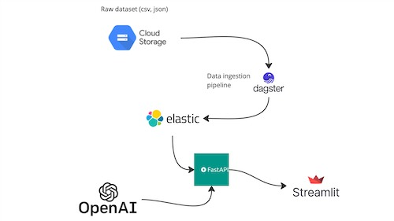
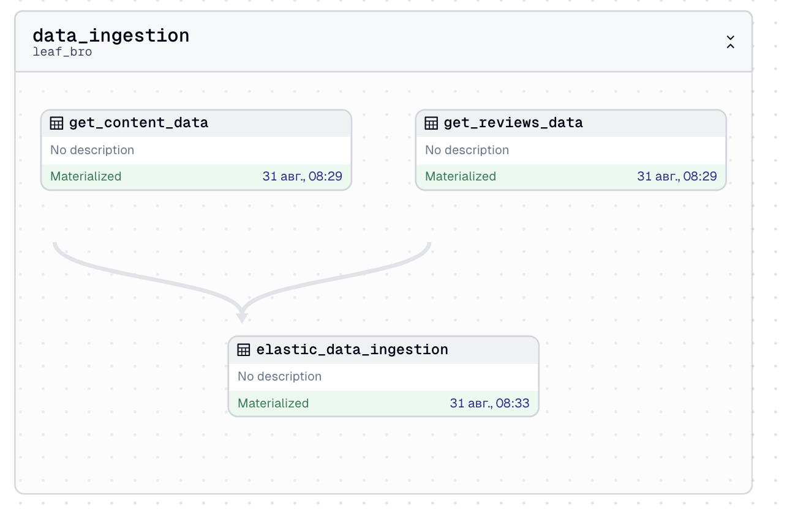
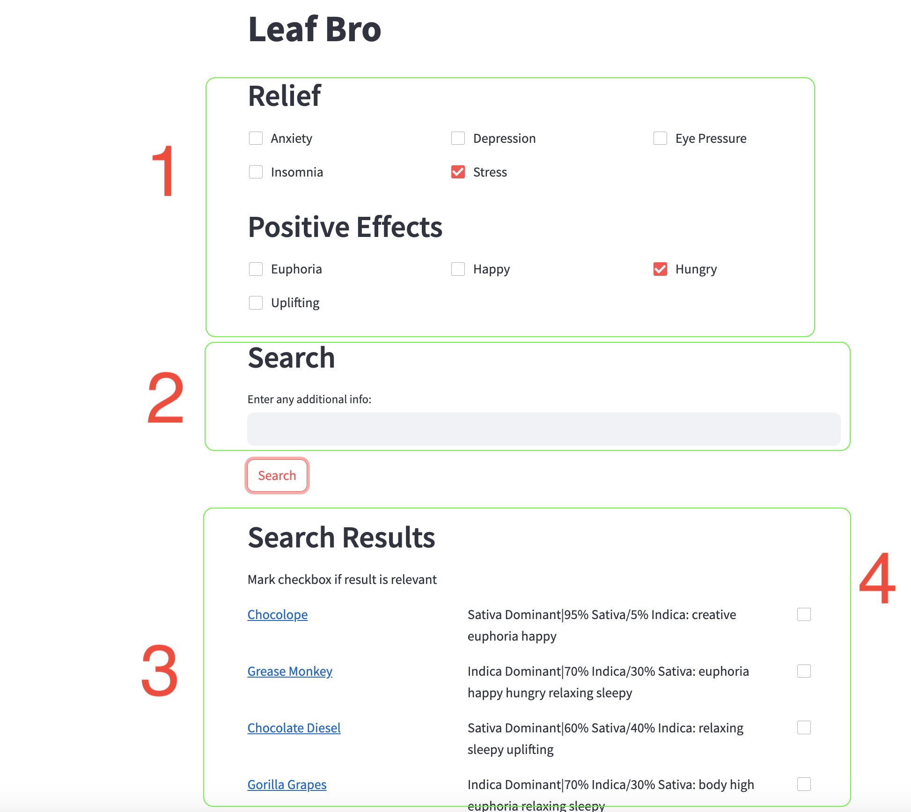
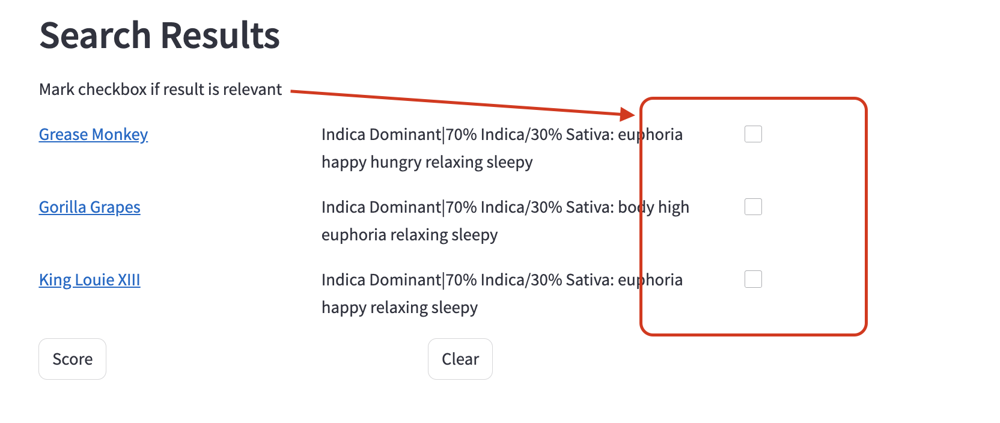

# Leaf bro

## Problem description

Create "shopping assistant" for [AllBud](https://www.allbud.com/).

[AllBud](https://www.allbud.com/) contains lots of strainn. It is a problem to find good enough item because of lots of parametres: effects, flavors, possible relief.

It is not enough to use filters, because I want to wrap exploring process to dialog form (like when you chatting with bud-tender in store).

I want to test a hypoteses that RAG is a best choice for such task


## RAG FLOW

knowledge base
* csv file with content description: name, details, rating, num reviews
* json file with reviews

LLM
* Huggingface transformer model for embeddings
* OpenAI API for document reranking based on user feedback



Prepare directories (`./data` with all subdirectories)
```shell
make prepare-dirs
```

Get the data: download [files](https://drive.google.com/drive/folders/1Vf4eYCGThQHXo0E8A27somP0Z0fa2DbF?usp=drive_link)

* content_leaf_bro.csv
* content_reviews_green_bro.csv
* golden_dataset.csv

Place all files above to `./data/pipelines_data` to avoid using Google Cloud Storage (GCS is for running in cloud).

### Data ingestion

Ingestion pipeline

2 points: Automated ingestion with a Dagster for scheduling



Run Elasticsearch

```shell
 make elastic
```

Run dagster
```shell
make run-dagster
```


## Retrieval evaluation

Golded datased prepared based on reviews database (look at [eda.ipynb](./jupyter_notebooks/eda.ipynb))

Multiple retrieval approaches are evaluated:
* vector search
* hybrid search (vector + keywords)

and the best one is used for production service

## RAG evaluation

0 points: No evaluation of RAG is provided

## Interface

2 points
* Streamlit for UI
* FastAPI for API (API gateway for OpenAI and Elastic). Documentation is available on [/docs](http://0.0.0.0:8000/docs)

Streamlit interface



##  Monitoring

1 point: User feedback is collected OR there's a monitoring dashboard

User able to give feedback with checkbocx on the right side



Scored items are pushed to api `/feedback` endpoing

## Containerization

2 points: Everything is in docker-compose

Also API container is pushed to [dockerhub](https://hub.docker.com/repository/docker/adzhumurat/leaf_bro_api/general)


## Reproducibility

2 points: Instructions are clear, the dataset is accessible, it's easy to run the code, and it works. The versions for all dependencies are specified.

## Best practices

* [ ] Hybrid search: combining both text and vector search (at least evaluating it) (1 point)
* [ ] Document re-ranking (1 point)
* [ ] User query rewriting (1 point)


# Dagster 

## Getting started

First, install your Dagster code location as a Python package. By using the --editable flag, pip will install your Python package in ["editable mode"](https://pip.pypa.io/en/latest/topics/local-project-installs/#editable-installs) so that as you develop, local code changes will automatically apply.

```bash
pip install -e ".[dev]"
```

Then, start the Dagster UI web server:

```bash
dagster dev
```

Open http://localhost:3000 with your browser to see the project.

User interface

```shell
 ROOT_DIR=$(pwd)/data streamlit run services/client/src/app.py --server.port 8502
 ```

 ## Evaluation Criteria


* Bonus points (not covered in the course)
    * [ ] Deployment to the cloud (2 points)


## Development

### Adding new Python dependencies

You can specify new Python dependencies in `setup.py`.

### Unit testing

Tests are in the `leaf_bro_tests` directory and you can run tests using `pytest`:

```bash
pytest leaf_bro_tests
```

### Schedules and sensors

If you want to enable Dagster [Schedules](https://docs.dagster.io/concepts/partitions-schedules-sensors/schedules) or [Sensors](https://docs.dagster.io/concepts/partitions-schedules-sensors/sensors) for your jobs, the [Dagster Daemon](https://docs.dagster.io/deployment/dagster-daemon) process must be running. This is done automatically when you run `dagster dev`.

Once your Dagster Daemon is running, you can start turning on schedules and sensors for your jobs.

# Client

```shell
ROOT_DIR=$(pwd)/data streamlit run services/client/app.py --server.port 8502
```

future improvements: use ONNX runtime