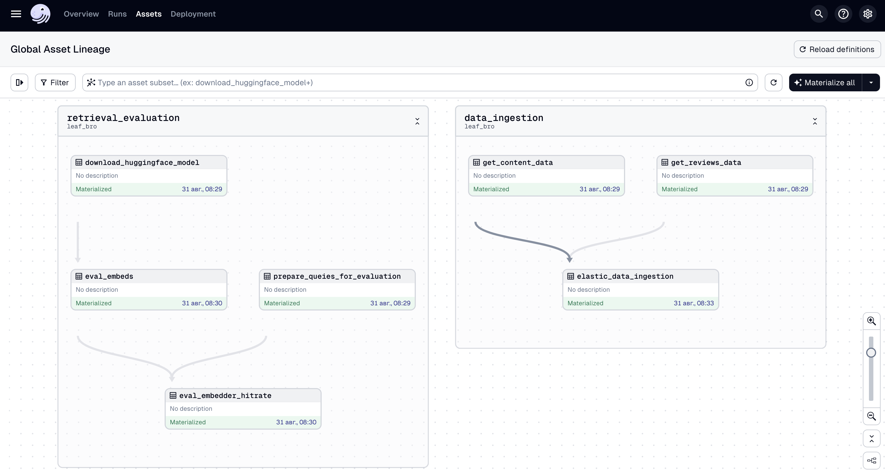

# leaf_bro

Prepare directories (`./data` ad all subdirectories)
```shell
make prepare-dirs
```

Data for run: download [files](https://drive.google.com/drive/folders/1Vf4eYCGThQHXo0E8A27somP0Z0fa2DbF?usp=drive_link)

* content_leaf_bro.csv
* content_reviews_green_bro.csv
* golden_dataset.csv

Place all files above to `./data/pipelines_data` to avoid using Google Cloud Storage

# Data ingestion

Data ingestion overview



Run Elasticsearch

```shell
 make elastic
```

Run dagster
```shell
make run-dagster
```

## Getting started

First, install your Dagster code location as a Python package. By using the --editable flag, pip will install your Python package in ["editable mode"](https://pip.pypa.io/en/latest/topics/local-project-installs/#editable-installs) so that as you develop, local code changes will automatically apply.

```bash
pip install -e ".[dev]"
```

Then, start the Dagster UI web server:

```bash
dagster dev
```

Open http://localhost:3000 with your browser to see the project.

User interface

```shell
 ROOT_DIR=$(pwd)/data streamlit run services/client/app.py --server.port 8502
 ```


## Development

### Adding new Python dependencies

You can specify new Python dependencies in `setup.py`.

### Unit testing

Tests are in the `leaf_bro_tests` directory and you can run tests using `pytest`:

```bash
pytest leaf_bro_tests
```

### Schedules and sensors

If you want to enable Dagster [Schedules](https://docs.dagster.io/concepts/partitions-schedules-sensors/schedules) or [Sensors](https://docs.dagster.io/concepts/partitions-schedules-sensors/sensors) for your jobs, the [Dagster Daemon](https://docs.dagster.io/deployment/dagster-daemon) process must be running. This is done automatically when you run `dagster dev`.

Once your Dagster Daemon is running, you can start turning on schedules and sensors for your jobs.

# Client

```shell
ROOT_DIR=$(pwd)/data streamlit run services/client/app.py --server.port 8502
```